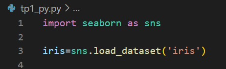
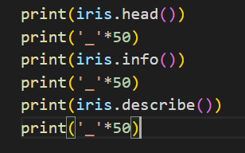
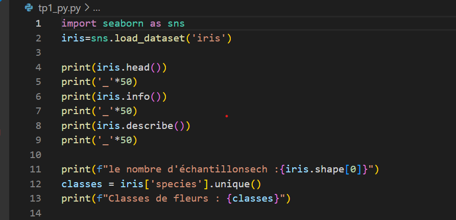
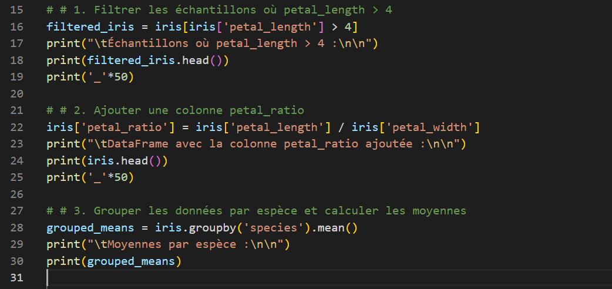
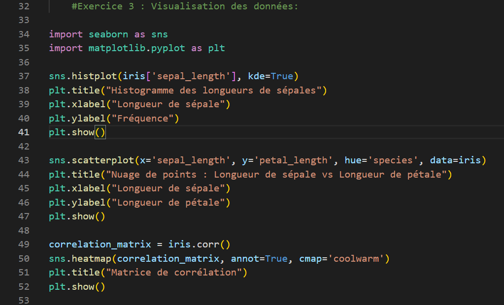
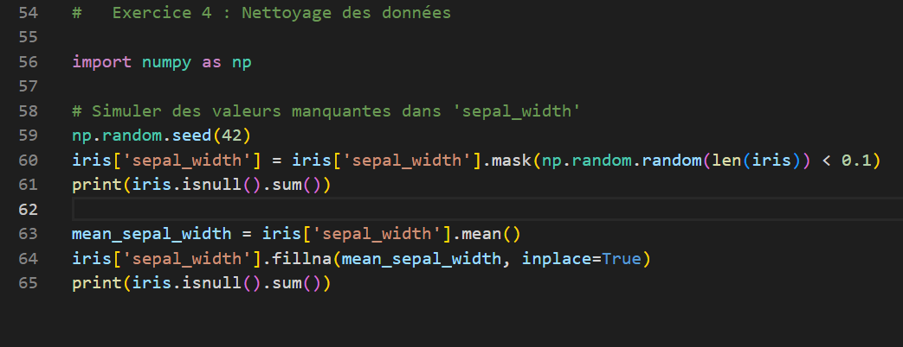
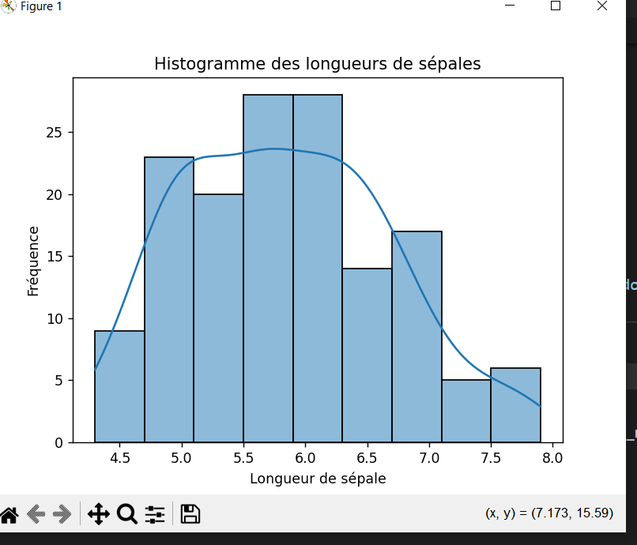
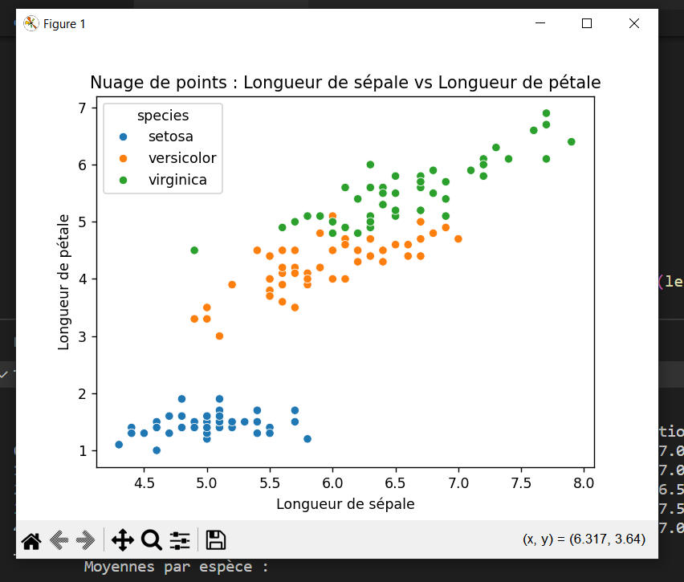
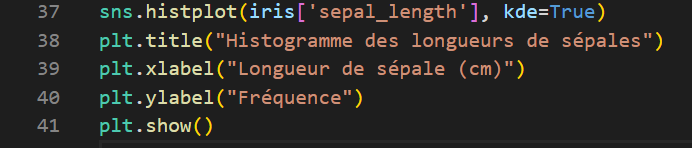

### README: TP 1 - Introduction à Python et Manipulation des Données

---

## **Objectifs pédagogiques**

À la fin de ce TP, nous serons capables de :
1. Charger et inspecter un dataset avec **Pandas**.
2. Manipuler les données : filtrer, transformer, grouper et analyser.
3. Visualiser des données avec **Matplotlib** et **Seaborn**.
4. Identifier et traiter les valeurs manquantes dans un dataset.

---

## **Prérequis**

### Connaissances nécessaires
- Bases de Python (boucles, fonctions, manipulations de listes).
- Comprendre le concept de DataFrame.

---

## **Matériel nécessaire**
Avant de commencer, assurez-vous d'avoir installé les bibliothèques nécessaires :

```bash
pip install numpy pandas matplotlib seaborn
```
 
---

## **Exercices**

### **Exercice 1 : Chargement et inspection des données**
1. Charger le dataset Iris avec **Seaborn**.
  
2. Explorer les données avec `head()`, `info()` et `describe()`.
  
3. Identifier le nombre d'échantillons et les classes de fleurs.
  

---
### **Exercice 2 : Exploration des données**
1. Filtrer les échantillons où `petal_length > 4`.
2. Ajouter une colonne `petal_ratio` calculée comme le ratio entre `petal_length` et `petal_width`.
3. Grouper les données par espèce et calculer les moyennes des colonnes numériques.
  

---
### **Exercice 3 : Visualisation des données**
1. Créer un histogramme des longueurs de sépales avec **Seaborn**.
2. Réaliser un nuage de points illustrant la relation entre `sepal_length` et `petal_length`, coloré par espèce.
3. Générer une matrice de corrélation et la visualiser sous forme de carte thermique avec **Seaborn**.
  

---
### **Exercice 4 : Nettoyage des données**
1. Simuler des valeurs manquantes dans la colonne `sepal_width`.
2. Remplacer les valeurs manquantes par la moyenne de la colonne.

  
---

## **Résultats attendus**

1. **Dataset nettoyé** :
   - Aucune valeur manquante dans `sepal_width`.
   - Colonne `petal_ratio` ajoutée.

2. **Graphiques** :
   - Histogramme montrant la distribution des longueurs de sépales.
   - Nuage de points montrant la relation entre `sepal_length` et `petal_length`, coloré par espèce.
   - Matrice de corrélation illustrant les relations entre les variables numériques.
     
  

  
  
3. **Améliorations visuelles** :
   - Ajouter des titres, des légendes et des annotations pour rendre les graphiques compréhensibles.

  
---
## **Auteur**
**BILAL ERRABIA**
