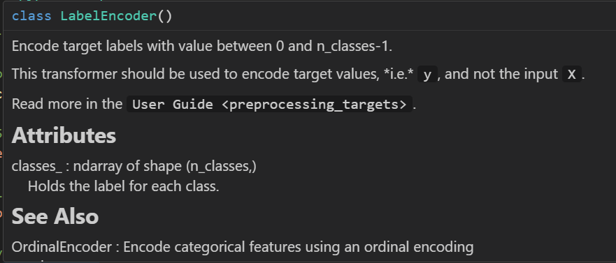
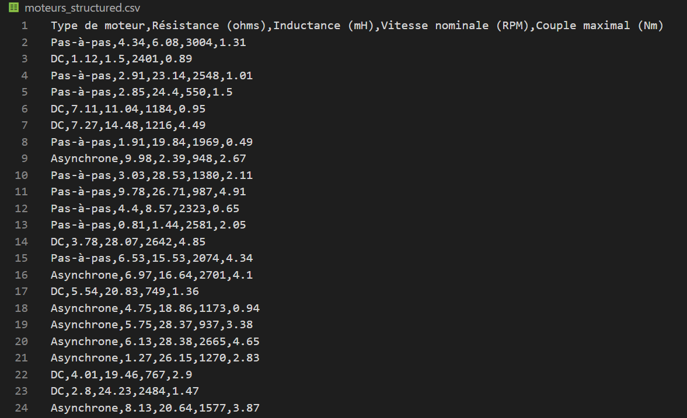
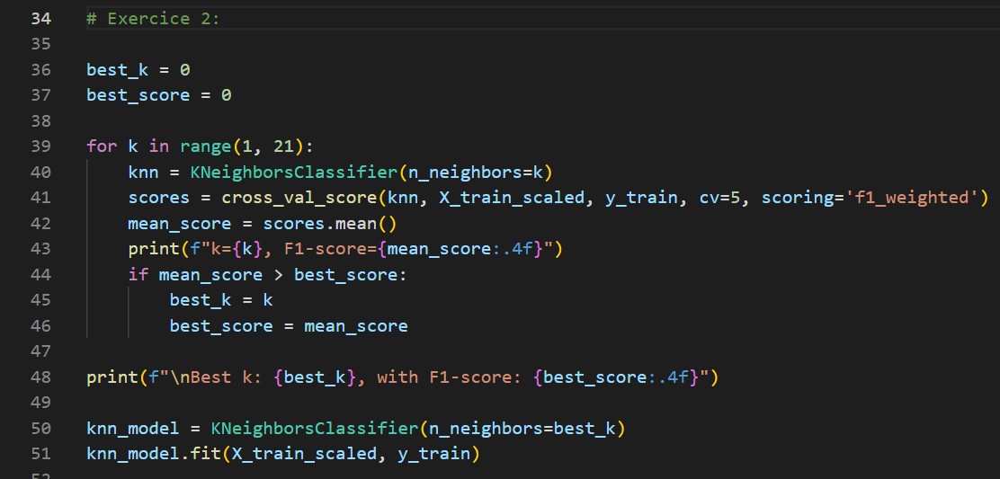
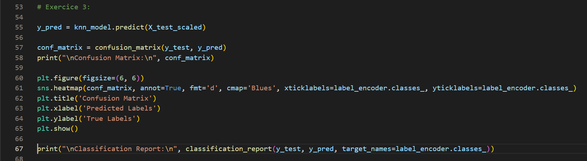
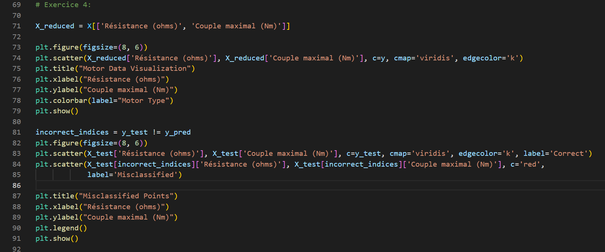
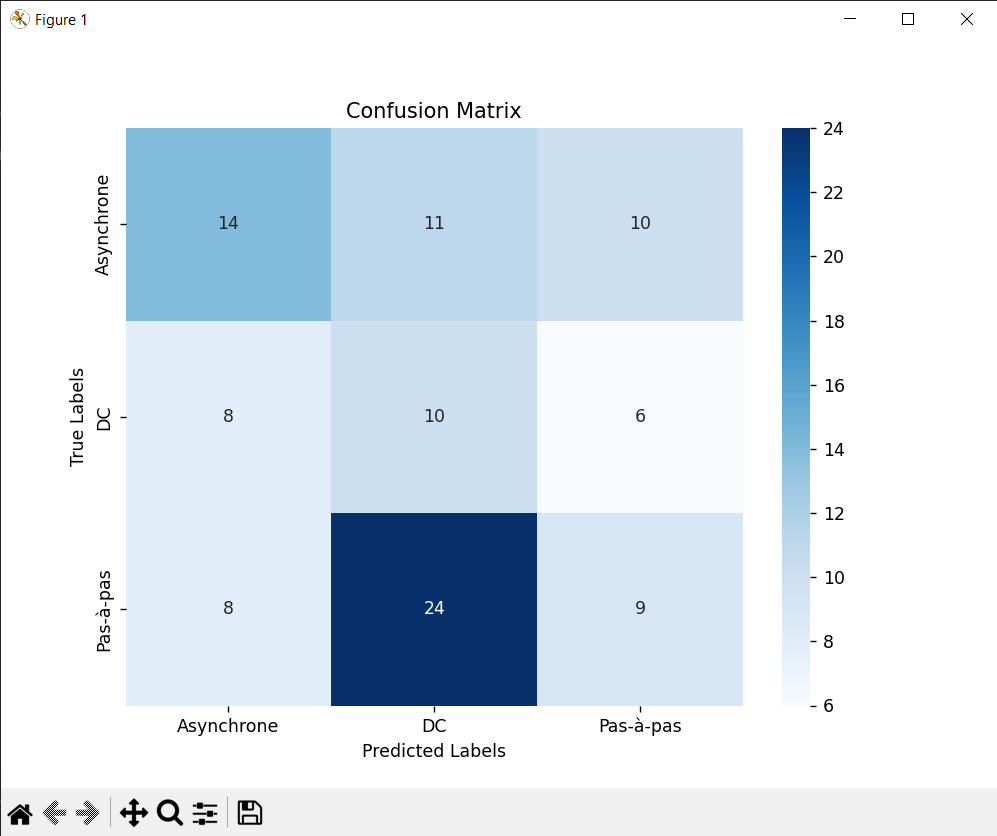
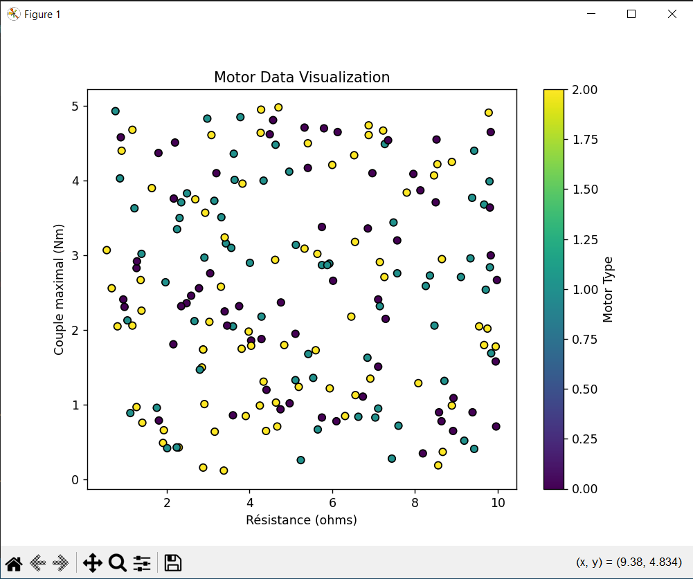
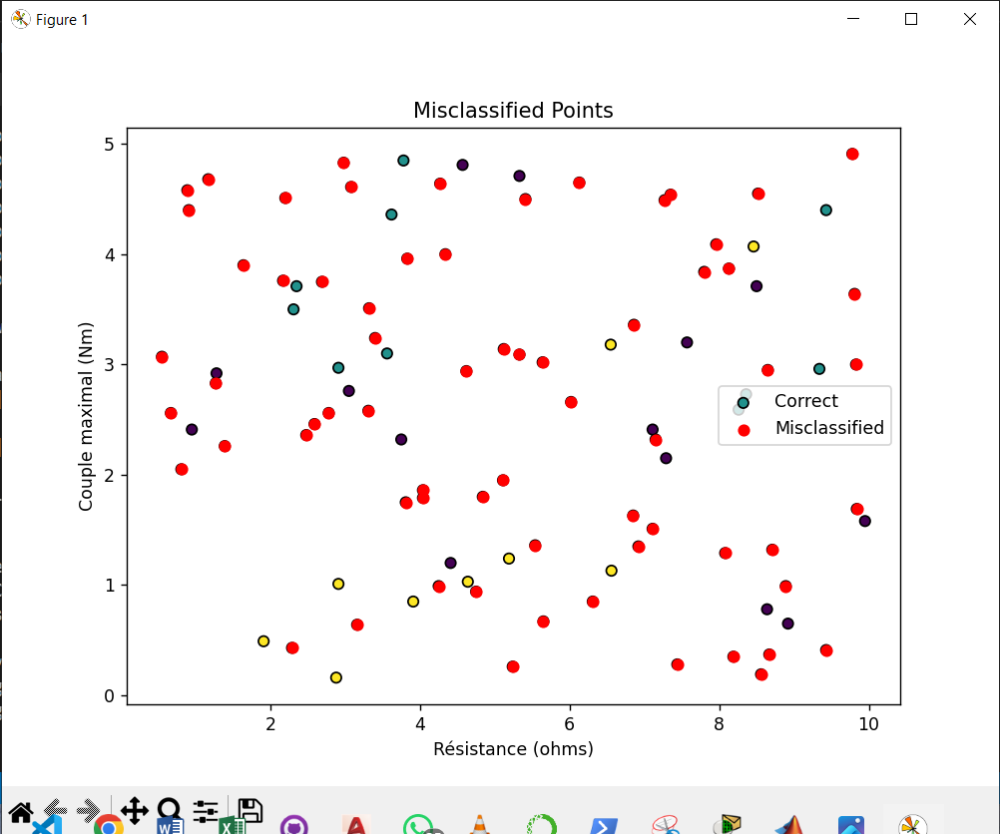

# Motor Type Classification with k-Nearest Neighbors (k-NN)

This project aims to classify electric motor types based on their characteristics (resistance, inductance, nominal speed, and maximum torque) using the k-Nearest Neighbors (k-NN) algorithm. The goal is to create a supervised classification model that identifies the type of motor, with possible categories being "DC", "Asynchrone", and "Pas-à-pas".

## Requirements

To run the code, you will need the following Python libraries:

- pandas
- scikit-learn
- seaborn
- matplotlib

To install these dependencies, you can use the following command:

```bash
pip install pandas numpy scikit-learn seaborn matplotlib
```

## Dataset
The dataset `moteurs_structured.csv` contains the following columns:

- `Type de moteur`: Motor type (target variable), with values: "DC", "Asynchrone", "Pas-à-pas"
- `Résistance (ohms)`: Resistance of the motor
- `Inductance (mH)`: Inductance of the motor
- `Vitesse nominale (RPM)`: Nominal speed of the motor
- `Couple maximal (Nm)`: Maximum torque of the motor
 


## Steps

### Exercice 1: Data Loading and Preparation

1. **Load the dataset**: Load `moteurs_structured.csv` using pandas.
2. **Encode the motor types**: Use LabelEncoder to convert the motor types into numerical values.(0.1.2)
 

3. **Separate features and target**: Split the dataset into features (`X`) and target (`y`).
4. **Train-Test Split**: Split the data into training (80%) and testing (20%) sets.
``` py 
X = data[['Résistance (ohms)', 'Inductance (mH)', 'Vitesse nominale (RPM)', 'Couple maximal (Nm)']]
y = data['Type_encoded']
X_train, X_test, y_train, y_test = train_test_split(X, y, test_size=0.2, random_state=42)
```
5. **Display statistical summary**: Show a summary of the dataset.
 

---
### Exercice 2: k-NN Model Implementation
1. **Import the k-NN classifier**: Create a k-NN model with the best k between`k=1 and k=21`.
2. **Train the model**: Fit the k-NN model to the training data.
 

### Exercice 3: Model Evaluation

1. **Make predictions**: Predict the labels for the test set.
2. **Confusion Matrix**: Generate a confusion matrix to assess the classification performance.
3. **Evaluation metrics**: Display precision, recall, and F1-score for each class.
4. **Interpretation**: Analyze the results from the confusion matrix and classification report.

 
### Exercice 4: Visualizing Model Performance

1. **Feature Reduction**: Reduce the data to two main features (e.g., resistance and torque).
2. **Scatter Plot**: Plot the data points with different colors based on the predicted class.
3. **Misclassified Points**: Annotate misclassified data points on the plot.

 
### Exercice 5: Linear Regression Comparison

1. **Linear Regression Model**: Train a multiple linear regression model using the same features.
2. **Model Evaluation**: Evaluate the linear regression model's performance using Mean Squared Error (MSE) and R².
3. **Comparison**: Compare the performance of k-NN and linear regression in terms of classification accuracy and suitability for the problem.

``` py
logistic_model = LogisticRegression(max_iter=1000)
logistic_model.fit(X_train_scaled, y_train)

y_pred_logistic = logistic_model.predict(X_test_scaled)

print("\nRapport de classification (Régression logistique) :\n", classification_report(y_test, y_pred_logistic, target_names=label_encoder.classes_))
```
## Results

- The final k-NN model will be able to classify motors into the correct types.
 
- A confusion matrix and classification report will show the precision and errors made by the k-NN model.
- Visualizations will help understand the distribution and misclassification of data points.
 
 
- A comparison of k-NN and linear regression will demonstrate which model is more appropriate for this classification task.


### Conclusion:

## Pourquoi le k-NN Surpasse la Régression Linéaire
Le k-NN surpasse la régression linéaire dans ce cas en raison de sa capacité à gérer des relations complexes et non linéaires entre les caractéristiques et les classes. Contrairement à la régression linéaire, qui cherche à établir une relation globale à travers une fonction linéaire, le k-NN base ses prédictions sur des décisions locales en se concentrant sur les voisins les plus proches pour classer les données. Cette approche lui permet de mieux s'adapter lorsque les classes ne sont pas facilement séparables par une simple ligne droite. De plus, l'utilisation d'une mise à l'échelle des caractéristiques avec le StandardScaler est essentielle pour le k-NN, car elle garantit que les différentes échelles des caractéristiques n'influencent pas de manière disproportionnée les mesures de distance, ce qui améliore la précision des classifications.
    