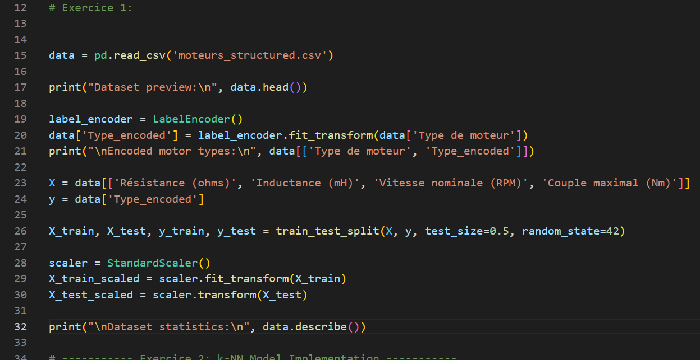
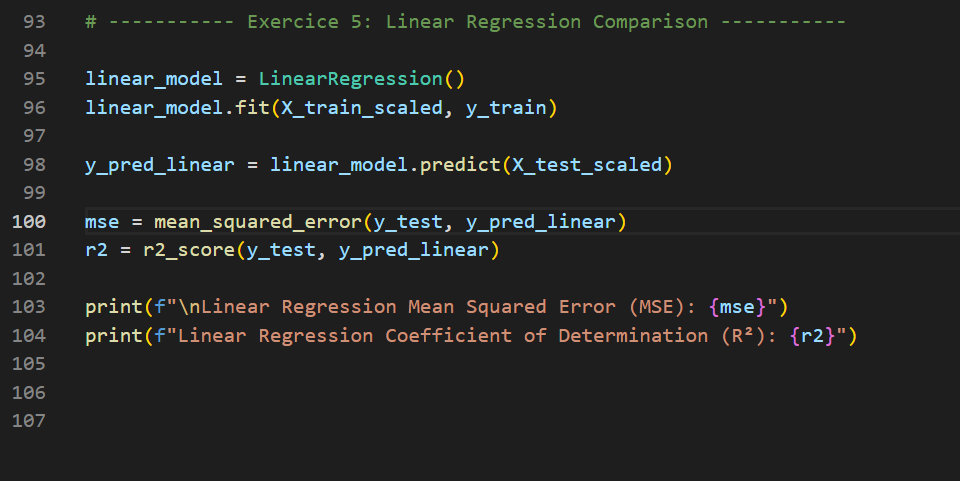

Here is the updated README file based on the new guidelines provided for the project:

---

# Motor Type Classification with k-Nearest Neighbors (k-NN)

This project aims to classify electric motor types based on their characteristics (resistance, inductance, nominal speed, and maximum torque) using the k-Nearest Neighbors (k-NN) algorithm. The goal is to create a supervised classification model that identifies the type of motor, with possible categories being "DC", "Asynchrone", and "Pas-à-pas".

## Requirements

To run the code, you will need the following Python libraries:

- pandas
- numpy
- scikit-learn
- seaborn
- matplotlib

To install these dependencies, you can use the following command:

```bash
pip install pandas numpy scikit-learn seaborn matplotlib
```

## Dataset
The dataset `moteurs_structured.csv` contains the following columns:

- `Type de moteur`: Motor type (target variable), with values: "DC", "Asynchrone", "Pas-à-pas"
- `Résistance (ohms)`: Resistance of the motor
- `Inductance (mH)`: Inductance of the motor
- `Vitesse nominale (RPM)`: Nominal speed of the motor
- `Couple maximal (Nm)`: Maximum torque of the motor
 

## Steps

### Exercice 1: Data Loading and Preparation

1. **Load the dataset**: Load `moteurs_structured.csv` using pandas.
2. **Encode the motor types**: Use LabelEncoder to convert the motor types into numerical values.
3. **Separate features and target**: Split the dataset into features (`X`) and target (`y`).
4. **Train-Test Split**: Split the data into training (80%) and testing (20%) sets.
5. **Display statistical summary**: Show a summary of the dataset.
 

### Exercice 2: k-NN Model Implementation

1. **Import the k-NN classifier**: Create a k-NN model with `k=3`.
2. **Train the model**: Fit the k-NN model to the training data.
 

### Exercice 3: Model Evaluation

1. **Make predictions**: Predict the labels for the test set.
2. **Confusion Matrix**: Generate a confusion matrix to assess the classification performance.
3. **Evaluation metrics**: Display precision, recall, and F1-score for each class.
4. **Interpretation**: Analyze the results from the confusion matrix and classification report.
 

### Exercice 4: Visualizing Model Performance

1. **Feature Reduction**: Reduce the data to two main features (e.g., resistance and torque).
2. **Scatter Plot**: Plot the data points with different colors based on the predicted class.
3. **Misclassified Points**: Annotate misclassified data points on the plot.
 

### Exercice 5: Linear Regression Comparison

1. **Linear Regression Model**: Train a multiple linear regression model using the same features.
2. **Model Evaluation**: Evaluate the linear regression model's performance using Mean Squared Error (MSE) and R².
3. **Comparison**: Compare the performance of k-NN and linear regression in terms of classification accuracy and suitability for the problem.
 

## Results

- The final k-NN model will be able to classify motors into the correct types.
- A confusion matrix and classification report will show the precision and errors made by the k-NN model.
 
- Visualizations will help understand the distribution and misclassification of data points.
 
- A comparison of k-NN and linear regression will demonstrate which model is more appropriate for this classification task.
 

## Conclusion

By completing this project, we will gain hands-on experience in applying the k-NN algorithm for classification tasks, evaluating model performance, and comparing it with other machine learning models such as linear regression. This project will also help we better understand classification tasks in the context of mechatronics.

---
